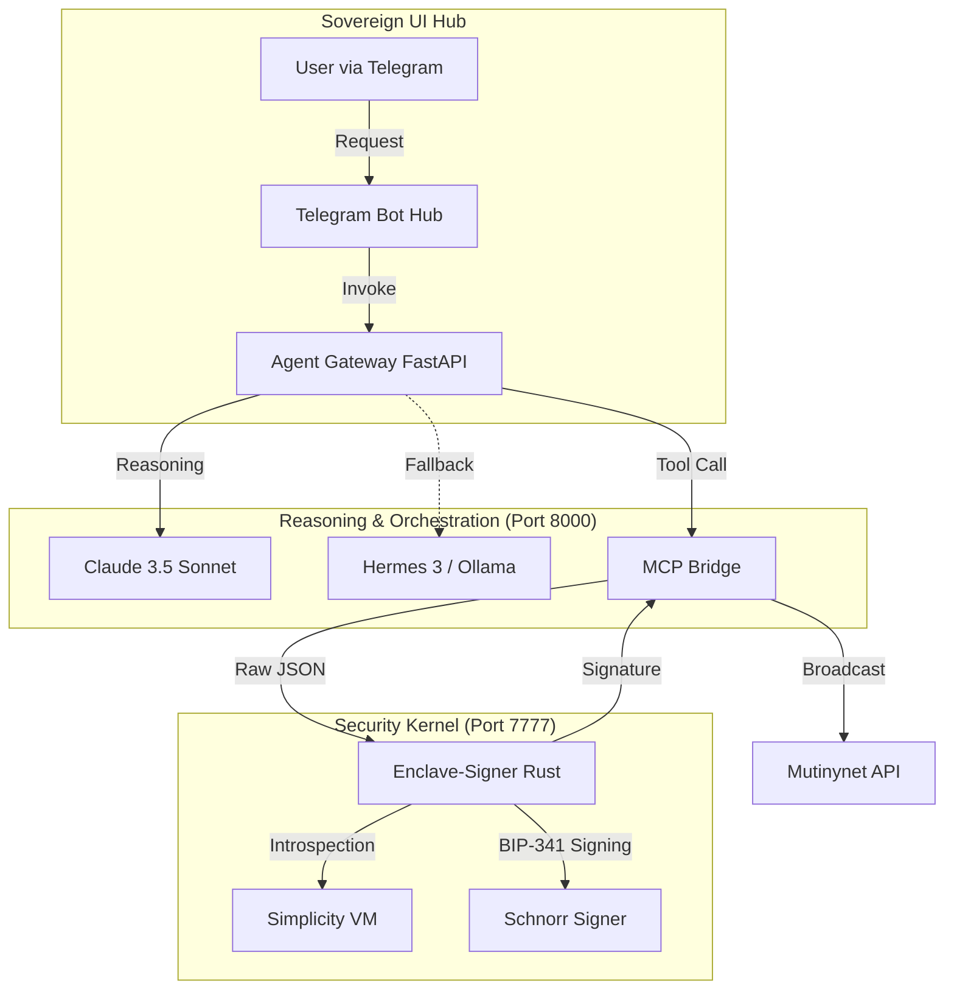

# 🏛️ Sovereign Bitcoin Agent Architecture (PRECOP Protocol)

This document outlines the decentralized, TEE-hardened architecture that powers the Sovereign Bitcoin Agent, ensuring trustless financial autonomy via Simplicity-enforced governance.

---

## 🏗️ System Overview

The system is split into two primary layers: the **Execution Layer** (Wallet Agent) and the **Data Layer** (Price Oracle).

### Interaction Flow (Production)

---

## 🌳 Repository Structure

### 1. `agent-gateway/`
The high-level entry point and reasoning engine.
- `agent_server.py`: FastAPI gateway coordinating LLM reasoning and the Bridge.
- `telegram_bot.py`: Front-end integration for real-world user interaction.

### 2. `enclave-signer/`
The "Truth Machine" and secure signer (Rust).
- `src/main.rs`: TCP server handling raw JSON requests for signing.
- `src/signer.rs`: BIP-341/BIP-86 cryptographic kernel.
- `src/simplicity_engine.rs`: Simplicity-inspired VM for policy enforcement.

### 3. `mcp-bridge/`
The protocol normalization layer.
- `bridge.py`: Translates high-level reasoning intents into bit-perfect Enclave commands.

---

## 🛡️ Critical Security Enforcement

### 1. Bit Machine Introspection
The `enclave-signer` uses a Simplicity Bit Machine to analyze every incoming PSBT. It calculates weights and values to ensure they do not violate the `allowance.simf` contract.
*Current limit: **100,000 sats** per cycle.*

### 2. BIP-341 / BIP-86 Standard
The agent implements a perfect **Taproot Keypath Spend** (BIP-86). The enclave applies the required tweak to its internal key pair, ensuring the `signature` + `SIGHASH_ALL` byte is valid for the `scriptPubKey` on Mutinynet.

### 3. Failover Resilience
If the primary cloud reasoning (Claude) is unavailable or lacks credits, the gateway automatically falls back to a local **Hermes 3** (Ollama) instance. This ensures the agent remains sovereign and functional even in an isolated environment.

---

*Part of the PRECOP Protocol: Forging Trustless Autonomy on Bitcoin L1.*
